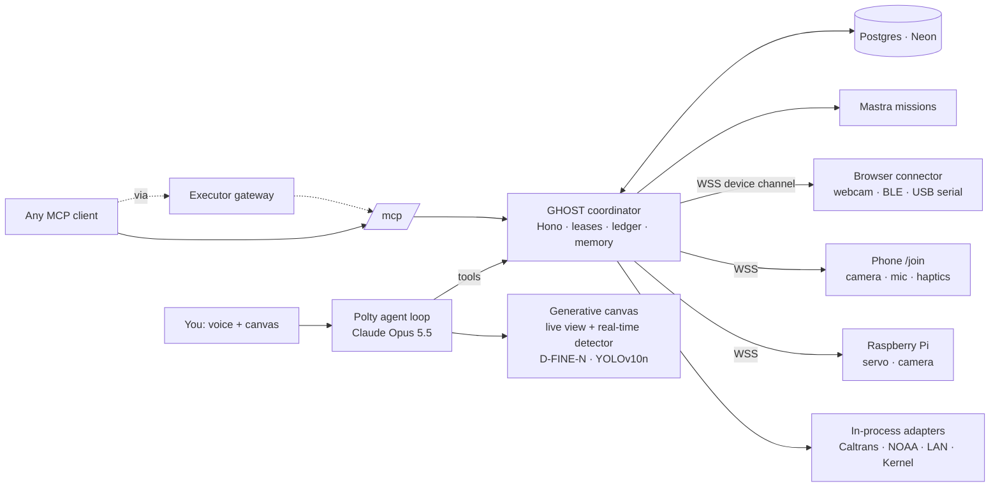

<div align="center">

# GHOST

**Your agent knows what to do. GHOST finds it the eyes, hands and instruments to do it.**

An open-source network for personal agents to borrow physical capabilities — phone cameras and
microphones, Bluetooth lights, USB microcontrollers, Raspberry Pi actuators, smart-home devices,
public traffic cameras and tide stations — through one lifecycle:
**discover → negotiate → lease → act → observe → remember → give it back.**

Meet **Polty**, the poltergeist: a voice agent with no body of its own that temporarily possesses
devices, with permission, and shows you what it sees on a generative canvas.

</div>

---

## What it does

| You say | What happens |
| --- | --- |
| "Find a live camera on the Bay Bridge and track the trucks." | Polty searches 756 Caltrans cameras, opens a live HLS stream on the canvas, runs a real-time object detector (D-FINE-N, Apache-2.0; YOLOv10n optional) **in your browser**, locks onto a truck and auto-zooms a follow-cam. |
| "Pair my phone so you can see and hear through it." | A QR code appears. Your phone opens `/join`, you confirm it on the laptop, and the phone becomes a body: camera, microphone, speaker, screen, haptics, motion, location, torch. |
| "What's on my Wi-Fi? Turn the lights purple." | A radar scans mDNS / SSDP / Kasa discovery, fingerprints Shelly, WLED, Hue, Kasa, Elgato, Tasmota, Roku and Home Assistant, publishes what it can drive, and switches them. |
| "Connect my Arduino and wave the servo." | You click once (browsers require it), Web Serial opens, the board announces its capabilities over the GHOST serial protocol, Polty moves the servo. Same for Bluetooth LE lights and heart-rate straps. |
| "Did I leave my keys at the workshop? You can spend up to $1." | Polty finds a camera whose view is blocked, discovers another owner's actuator that lifts the cover, negotiates terms with that owner's host agent, pays a **test** payment within budget, lifts the cover, takes a new photo — and says "I can't verify that" when the evidence doesn't support an answer. |
| "How high is the tide in San Francisco?" | A NOAA station reading with its datum, quality flag and real measurement time. Predictions are never presented as measurements. |

Every result on the canvas carries provenance: who operates the device, when the world was actually
captured (or "unknown"), and whether a physical action was **verified**, merely **acknowledged**, or
**unknown**.

## Why it's different

- **Device-agnostic contract, many transports.** A printer and a telescope use different drivers but
  the same discovery → offer → lease → invocation → observation lifecycle. Browser APIs, Web
  Bluetooth, Web Serial, LAN HTTP/UDP/TCP, public HTTP APIs, GPIO and WebRTC all publish into one
  catalog ([protocol](docs/protocol.md)).
- **Code enforces access, not the model.** Reservations are exclusive at the database level,
  budgets and quotas are checked in transactions, leases expire, owners can **Stop access** at any
  time, late payments never activate an expired reservation, and a model saying "I accept" never
  moves hardware.
- **Honest by construction.** `unknown` is not success. Capture time is never faked with retrieval
  time. Simulators are labeled. The development ledger is labeled as test funds.
- **One brain, many bodies.** The model and task memory stay in the coordinator; a new body changes
  the available tools, not the agent.
- **Open to every agent.** The same application logic is exposed over HTTP and as an
  **MCP server** (`/mcp`), so Claude Code, Cursor or any MCP client can lease your hardware.

## Architecture



- `server.ts` — one Node server: Next.js UI + coordinator API (`/api/v1`) + MCP (`/mcp`) + device
  channel (`wss://…/v1/device-channel`).
- `src/lib/ghost/` — contracts, coordinator (catalog, leases, invocations, pairing, ledger, memory),
  adapters (Caltrans, NOAA, LAN smart home, Kernel).
- `src/lib/agent/` — Polty's tools, system prompt and browser-side agent loop.
- `src/lib/connector/` — browser connector SDK and drivers (camera, mic, speaker, display, haptics,
  motion, location, battery, Web Bluetooth, Web Serial, WebRTC).
- `src/lib/vision/` — in-browser object detection (Web Worker + ONNX Runtime Web/WebGPU), tracker
  and follow-cam.
- `src/mastra/` — Mastra workflows for multi-step physical missions with a verification checkpoint.
- `connectors/raspberry/` — Python Pi connector. `connectors/arduino/` — GHOST serial sketch.

## Quick start

```bash
pnpm install
cp .env.example .env.local     # add a Claude credential (see below); everything else is optional
pnpm dev                       # http://localhost:3000
```

With no database configured GHOST uses embedded Postgres (PGlite) in `.ghost/` — no account needed.

**Claude.** Either `ANTHROPIC_API_KEY`, or route through Neon AI Gateway with
`NEON_AI_GATEWAY_BASE_URL` + `NEON_AI_GATEWAY_TOKEN`. Default model: `claude-opus-5-5`
(`GHOST_MODEL`, `GHOST_EFFORT=low` for snappy voice).

**Phones** need a trusted HTTPS origin for the camera. Deploy to Fly.io ([docs/deploy.md](docs/deploy.md))
or use a tunnel, and set `NEXT_PUBLIC_PUBLIC_ORIGIN`.

**Voice.** Chrome/Edge speech recognition for input; ElevenLabs (`ELEVENLABS_API_KEY`) for Polty's
voice, falling back to the browser voice. Hold <kbd>Space</kbd> or click Polty to talk.

### Connect an MCP client

```bash
claude mcp add --transport http ghost http://localhost:3000/mcp \
  --header "Authorization: Bearer <owner_token from /api/v1/me>"
```

Tools: `search_capabilities`, `get_capability`, `quote_lease`, `accept_quote`, `invoke_capability`,
`release_lease`, `recall_experience`, `record_experience`, `update_offer`, `revoke_lease`,
`list_leases`, `get_balance`.

## Partner integrations

Each integration does a job in the product and is optional — the core runs without any account.

| Partner | Role in GHOST | Env |
| --- | --- | --- |
| **Neon** | Postgres for catalog, leases, ledger and memory; **Neon AI Gateway** serves Claude Opus 5.5 to Polty | `DATABASE_URL`, `NEON_AI_GATEWAY_BASE_URL`, `NEON_AI_GATEWAY_TOKEN` |
| **Mastra** | Workflows for multi-step physical missions (photo → actuate → photo → suspend for verdict → release → remember), traced in Mastra Studio | none (`pnpm mastra:dev`) |
| **Fly.io** | Always-on HTTPS host so phones can pair and devices keep their WebSockets | `fly.toml`, `Dockerfile` |
| **Exa** | Finds public webcams and data sources that aren't in the catalog yet | `EXA_API_KEY` |
| **Kernel** | Cloud browsers turn a public webcam page into an observation capability, with a live view | `KERNEL_API_KEY` |
| **AgentMail** | Polty's own inbox: emails evidence reports with photos attached, reads replies | `AGENTMAIL_API_KEY` |
| **Executor** | MCP gateway: Polty can call your connected tools; GHOST's MCP server can be added to Executor so any agent reaches your hardware | `EXECUTOR_MCP_URL`, `EXECUTOR_TOKEN` |
| **assistant-ui** | The conversation panel: every spoken turn and tool call, on the external-store runtime over our own agent loop | — |
| **Interfere** | Production visibility for the Next app and coordinator (errors, failed invocations) | `INTERFERE_PUBLIC_KEY`, `INTERFERE_API_KEY` |
| **CodeRabbit** | Reviews PRs with repo-specific rules for hardware honesty, device-channel auth and SSRF | `.coderabbit.yaml` |

Details and verification status: [docs/partners.md](docs/partners.md), [docs/partners-infra.md](docs/partners-infra.md).

## Hardware support (honest matrix)

| Path | Status |
| --- | --- |
| Phone camera / mic / speaker / screen / haptics via `/join` | Implemented; requires HTTPS; Chrome Android has the most APIs (torch, vibration), iOS Safari fewer |
| Laptop webcam / mic | Implemented |
| Web Bluetooth LED strips (ELK-BLEDOM / Triones families), heart rate, battery | Implemented from documented protocols; Chrome/Edge desktop |
| Web Serial microcontrollers (GHOST serial protocol) | Implemented + Arduino sketch |
| Raspberry Pi servo / camera (`connectors/raspberry`) | Implemented with a labeled `--simulate` mode |
| LAN: Shelly, WLED, Hue, Kasa, Tasmota, Elgato, Roku, Home Assistant | Implemented; tested against labeled simulators |
| Caltrans CCTV stills + live HLS, NOAA CO-OPS stations | Live-verified |

See [docs/connectors.md](docs/connectors.md), [docs/smart-home.md](docs/smart-home.md),
[docs/public-sources.md](docs/public-sources.md).

## Tests

```bash
pnpm coord:smoke          # 75 coordinator checks: leases, exclusivity, budget, expiry, revoke, MCP…
pnpm infra:mission-test   # Mastra mission end-to-end against a real coordinator
pnpm exec tsx scripts/lan-test.ts   # smart-home drivers against simulators
```

## License

MIT for original code — see [LICENSE](LICENSE). Public data sources keep their operators' terms
(Caltrans, NOAA). Detector weights are downloaded at runtime from their publishers under their own
licenses ([docs/public-sources.md](docs/public-sources.md)).
